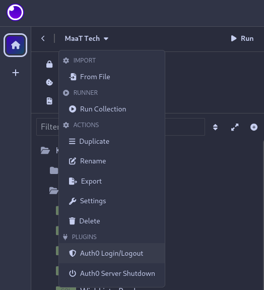
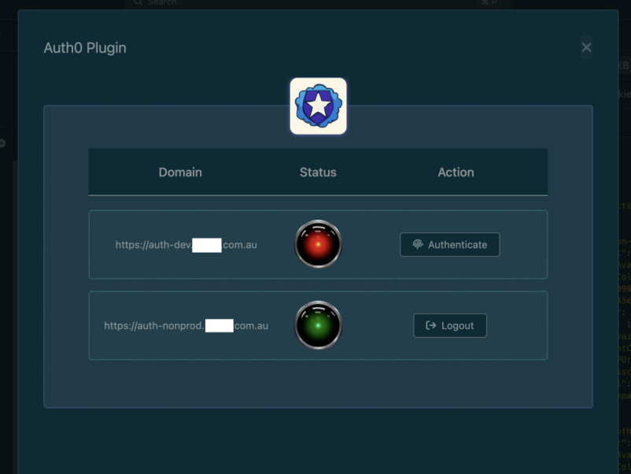

# Auth0 plugin for Insomnia

Seamless store and refresh Auth0 tokens that can be automatically injected into requests, depending on configured urls/methods.
It will add a **Authorization** header to the requests that match your configuration.
The value of the header is the options set for *auth0AuthType* (e.g Bearer) follow by the existing Auth0 token for that url.
Refresh Token Expiration

## Installation

Get if from the [Insomnia plugin store](https://insomnia.rest/plugins) or install it manually:
1. Clone the repository:
   ```bash
   git clone

2. Install dependencies:
   ```bash
   yarn 
   ```
3. Build the plugin:
   ```bash
   yarn build
   ```
4. Install:
   ```bash
   yarn local
   ```

## Auth0

The domain, clientId, audience and scope defined for your application on [Auth0](https://auth0.com/docs/get-started/applications/application-settings) are required: these are usually publicly available .
Callback and Logout Urls  settings on Auth0 are required to include *localhost* on some port.

### SDK

The *cacheLocation* is set to 'localstorage' and *useRefreshTokens* is set to true: these are not configurable at the moment.
For login, the method *loginWithRedirect()* is used and for *logout()* for logout.
Both methods *isAuthenticated()* and *getTokenSilently()* are used to confirm if the user is logged in. 

### Embeded webserver

Callback and Logout Urls are supported by a HTTP server running within Insomnia.
The server runs on port 3000 by default and is important for the authentication flow.
The port is configurable and most match your application configuration on Auth0.
There is a option to shutdown the server after login/logout in case the port is required by other service.

## Ignored Requests
For the requests that match the following cases, the Authorization Header will not include:
- The request Body includes 'IntrospectionQuery'.
- The request Header 'Authorization' already exists.

## Configuration

You should define one or more Auth0 *instances* and what URLs and methods the instance's token should be used.
The configuration should be set as a environment variable called *auth0Instances* in your [Insomnia environment](https://docs.insomnia.rest/insomnia/environment-variables).

- auth0HttpServerPort: The tcp port to be used by the internal HTTP server. Default: 3000.
- urlRegexs: Array of [Regex](https://developer.mozilla.org/en-US/docs/Web/JavaScript/Reference/Global_Objects/RegExp) used to match the Auth0 instance with the request's URL.
- auth0AuthType: The string that prefix the authentication token (e.g Basic). Default: Bearer.
- domain, clientId, audience and scope: As defined in your application setting on Auth0.

### Configuration changes
If the plugin identifies changes in the configuration during a session, it will re-initializing the Auth0 instances to avoid unexpected behaviour.
That means that all authenticated instances will be logged out. To avoid this, restart Insomnia as soon as you make changes.

### Example

```json
{
  "auth0Instances": [
    {
      "urlRegexs": ["dev.test.com"],
      "urlMethods": ["POST"],
      "auth0AuthType": "Bearer",
      "domain": "https://auth-dev.test.com",
      "clientId": "clientIdDev",
      "authorizationParams": {
        "audience": "https://api.dev.test.com/gateway/graphql",
        "scope": "openid profile email offline_access"
      }
    },
    {
      "urlRegexs": ["nonprod.test.com"],
      "urlMethods": ["GET"],
      "auth0AuthType": "Bearer",
      "domain": "https://auth-nonprod.test.com",
      "clientId": "clientIdNonProd",
      "authorizationParams": {
        "audience": "https://api.nonprod.test.com/gateway/graphql",
        "scope": "openid profile email offline_access"
      }
    }
  ],
  "auth0HttpServerPort": 3000
}

```

## Screenshots

### Workspace Actions



### Session Control


